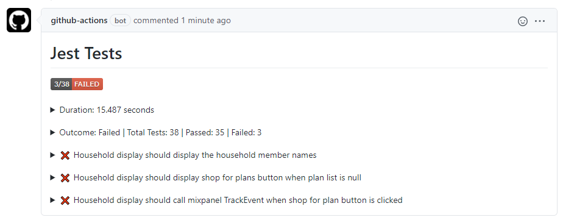
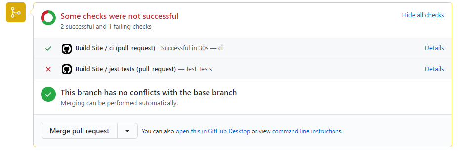
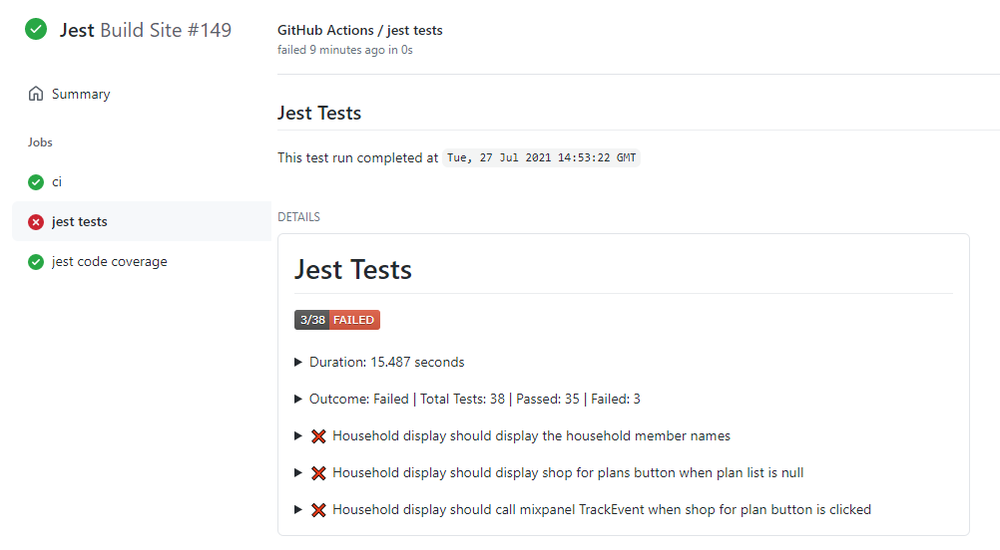
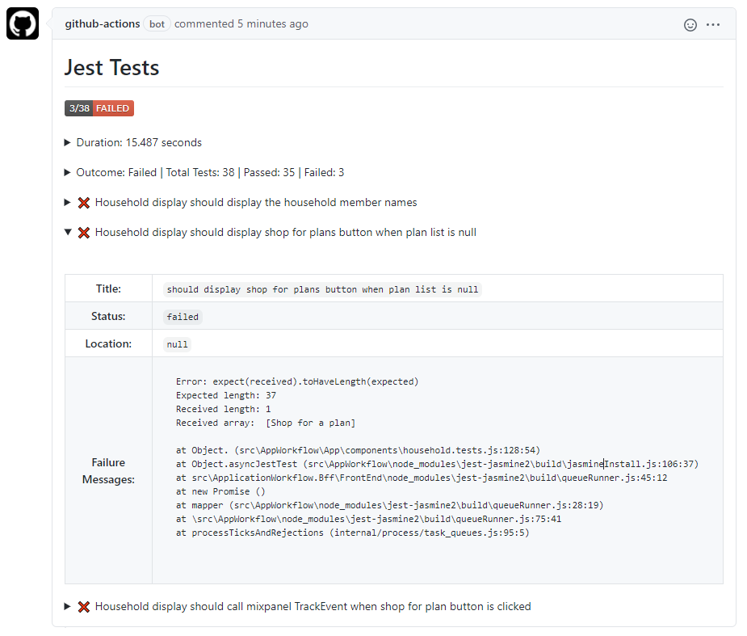

# process-jest-test-results

This action works in conjunction with another step that runs `jest test --json --outputFile=jest-results.json` and it parses the results from the outputted file.  This action will take the parsed results and create a Status Check or PR Comment depending on the flags set. 

This action does not run the Jest tests itself and it can only process one results file at a time.

- [process-jest-test-results](#process-jest-test-results)
  * [Failures](#failures)
  * [Limitations](#limitations)
  * [Action Outputs](#action-outputs)
  * [Inputs](#inputs)
  * [Outputs](#outputs)
  * [Usage Examples](#usage-examples)
  * [Recompiling](#recompiling)
  * [Code of Conduct](#code-of-conduct)
  * [License](#license)
  
## Failures
The status check can be seen as a new item on the workflow run, a PR comment or on the PR Status Check section.  If the test results contain failures, the status check will be marked as failed. Having the status check marked as failed will prevent PRs from being merged. If this status check behavior is not desired, the `ignore-test-failures` input can be set and the outcome will be marked as neutral if test failures are detected. The status badge that is shown in the comment or status check body will still indicate it was a failure though.

## Limitations
GitHub does have a size limitation of 65535 characters for a Status Check body or a PR Comment.  This action will fail if the test results exceed the GitHub [limit].  To mitigate this size issue only failed tests are included in the output.

If you have multiple workflows triggered by the same `pull_request` or `push` event, GitHub creates one checksuite for that commit.  The checksuite gets assigned to one of the workflows randomly and all status checks for that commit are reported to that checksuite. That means if there are multiple workflows with the same trigger, your status checks may show on a different workflow run than the run that created them.

## Action Outputs
### Pull Request Comment
This is shown on the pull request when the `create-pr-comment` is set to `true` and there is a PR associated with the commit.
<kbd></img></kbd>

### Pull Request Status Check
This is shown on the pull request when the `create-status-check` is set to `true` and there is a PR associated with the commit.
<kbd></img></kbd>

### Workflow Run
This is shown on the workflow run when the `create-status-check` is set to `true`.
<kbd></img></kbd>

### Failed Test Details
For failed test runs you can expand each failed test and view more details about the failure
<kbd></img></kbd>

## Inputs
| Parameter                      | Is Required | Default           | Description                                                                                                                                                                         |
| ------------------------------ | ----------- | ----------------- | ----------------------------------------------------------------------------------------------------------------------------------------------------------------------------------- |
| `github-token`                 | true        | N/A               | Used for the GitHub Checks API.  Value is generally: secrets.GITHUB_TOKEN.                                                                                                          |
| `results-file`                 | true        | N/A               | The json results file generated by jest.                                                                                                                                            |
| `report-name`                  | false       | jest test results | The desired name of the report that is shown on the PR Comment and inside the Status Check.                                                                                         |
| `create-status-check`          | false       | true              | Flag indicating whether a status check with jest test results should be generated.                                                                                                  |
| `create-pr-comment`            | false       | true              | Flag indicating whether a PR comment with jest test results should be generated.  When `true` the default behavior is to update an existing comment if one exists.                  |
| `update-comment-if-one-exists` | false       | true              | When `create-pr-comment` is true, this flag determines whether a new comment is created or if the action updates an existing comment if one is found which is the default behavior. |
| `ignore-test-failures`         | false       | `false`           | When set to true the check status is set to `Neutral` when there are test failures and it will not block pull requests.                                                             |
| `timezone`                     | false       | `UTC`             | IANA time zone name (e.g. America/Denver) to display dates in.                                                                                                                      |


## Outputs
| Output         | Description                                                                                                                                                           |
| -------------- | --------------------------------------------------------------------------------------------------------------------------------------------------------------------- |
| `test-outcome` | Test outcome based on presence of failing tests: *Failed,Passed*<br/>If exceptions are thrown or if it exits early because of argument errors, this is set to Failed. |

## Usage Examples

### Using the defaults
```yml
jobs:
  ci:
    runs-on: [ubuntu-20.04]
    steps:
      - uses: actions/checkout@v2

      - name: jest test with Coverage
        continue-on-error: true
        working-directory: 'src/ProjectWithJestTests' 
        run: jest --json --outputFile=jest-results.json

      - name: Process jest results with default
        if: always()
        uses: im-open/process-jest-test-results@v2.0.0
        with:
          github-token: ${{ secrets.GITHUB_TOKEN }}
          results-file: 'src/ProjectWithJestTests/jest-results.json
```

### Specifying additional behavior
```yml
jobs:
  advanced-ci:
    runs-on: [ubuntu-20.04]
    steps:
      - uses: actions/checkout@v2

      - name: jest test with results file
        continue-on-error: true
        working-directory: 'src/ProjectWithJestTests' 
        run: jest --json --outputFile=../../jest.json
      
      - name: Process jest results
        id: process-jest
        uses: im-open/process-jest-test-results@v1.0.1
        with:
          github-token: ${{ secrets.GITHUB_TOKEN }}
          results-file: 'jest.json'
          report-name: 'Jest Results'
          create-status-check: true
          create-pr-comment: false
          update-comment-if-one-exists: false
          ignore-test-failures: true
          timezone: 'america/denver'
      
      - run: ./do-other-things-in-the-build.sh

      - name: Fail if there were errors in the jest tests
        if: steps.process-jest.outputs.test-outcome == 'Failed'
        run: |
          echo "There were test failures."
          exit 1
```

## Recompiling

If changes are made to the action's code in this repository, or its dependencies, you will need to re-compile the action.

```sh
# Installs dependencies and bundles the code
npm run build

# Bundle the code (if dependencies are already installed)
npm run bundle
```

These commands utilize [esbuild](https://esbuild.github.io/getting-started/#bundling-for-node) to bundle the action and
its dependencies into a single file located in the `dist` folder.

## Code of Conduct

This project has adopted the [im-open's Code of Conduct](https://github.com/im-open/.github/blob/master/CODE_OF_CONDUCT.md).

## License

Copyright &copy; 2021, Extend Health, LLC. Code released under the [MIT license](LICENSE).

[limit]: https://github.com/github/docs/issues/3765